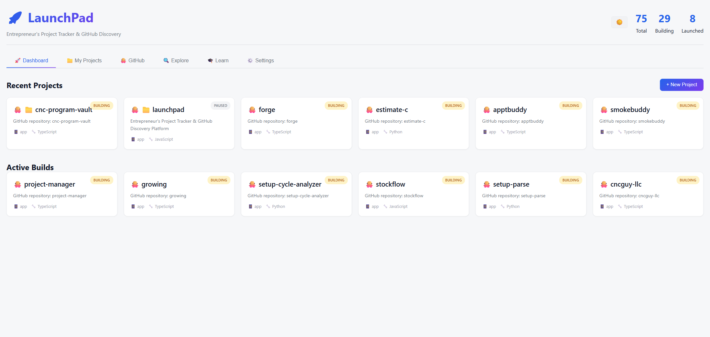
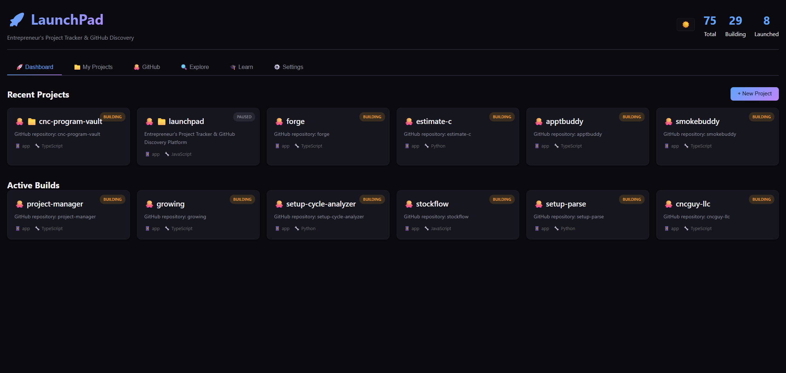

# 🚀 LaunchPad

> **Your idea-to-launch command center.** Track every project, bulk-import your whole GitHub, and watch sync status at a glance — in one fast, local, zero-config dashboard. No cloud, no account, no build step.




<details>
<summary>🌙 Dark theme</summary>



</details>

## Why LaunchPad?

- **One pane of glass** for everything you're building — idea → building → launched, with live counts.
- **Bulk-import your GitHub** and instantly see which repos are **ahead / behind / dirty** without leaving the app.
- **Local & private** — your data lives in a local SQLite file; the server binds loopback-only. No telemetry, no account.
- **Looks great in any light** — polished light/dark themes that follow your OS, with a one-click toggle.
- **Instant** — vanilla JS, no framework, no build pipeline. `npm install && npm start` and you're in.

> **Try it in 30 seconds:** `npm install && npm start` → open http://localhost:3020.

---

## Features

- **📊 Dashboard** — recent projects and active builds at a glance, with live counts (Total / Building / Launched).
- **📁 My Projects** — full CRUD; capture a project's vision, stack, status, and entry-points in the "Build Room" form.
- **🐙 GitHub** — bulk-import repos from your account, import a single repo by URL, and watch per-repo **sync status** (synced / ahead / behind / dirty).
- **🔍 Explore** — discover trending GitHub projects and templates.
- **🎓 Learn** — an interactive GitHub/dev-workflow bootcamp with levels, badges, and quizzes.
- **🧠 AI Review** — one click on a project with a local clone: Claude Opus 5 reads the README, manifests, file tree and recent commits and returns a scored verdict, risks and next 3 actions. Saved to the project's Build Log. Needs an Anthropic API key (Settings, or the `ANTHROPIC_API_KEY` env var); only file *names* plus a fixed set of docs/manifests are sent — never `.env` or other file contents.
- **⚙️ Settings** — GitHub token, Anthropic API key, clone base directory, and terminal preferences.
- **🌗 Dual theme** — light / dark / auto (follows your OS), with a persistent toggle.

For step-by-step task instructions, see the **[Usage guide / SWI → `docs/USAGE.md`](docs/USAGE.md)**.

---

## Quickstart

**Prerequisites:** Node.js `>=20 <26` (native `better-sqlite3` is ABI-sensitive).

```bash
npm install
npm start
```

Then open **http://localhost:3020**. The server binds to loopback (`127.0.0.1`) only.

---

## GitHub Authentication

GitHub import/discover features and git operations are **off until you set up auth** — a fresh clone's GitHub features silently no-op (or see only public repos) without it. Two independent pieces:

1. **Personal Access Token (PAT)** — used by the GitHub *API* (bulk import, discover, sync status). Set it on the in-app **Settings** page, or via the `GITHUB_TOKEN` env var. It is persisted in the SQLite `settings` table, auto-loaded on every boot, so you only enter it once. Use a fine-grained or classic token with `repo` (and `read:user`) scope.
2. **`gh auth setup-git`** (one-time, global) — lets plain `git clone/fetch/pull/push` use the GitHub CLI's stored OAuth token silently, with no PAT injection or credential prompts. Verify with:
   ```bash
   git config --global --get credential.https://github.com.helper
   ```

---

## Configuration

All settings live in the local SQLite DB (Settings page) — no cloud sync.

| Setting | What it does | Default / override |
|---|---|---|
| **GitHub PAT** | GitHub API access | Settings page, or `GITHUB_TOKEN` env |
| **Clone base directory** | where new clones land | `~/github`; override via Settings or `CLONE_BASE_DIR` env |
| **Default terminal** | which terminal "Open Terminal" launches | Settings page; platform default otherwise |
| **Theme** | light / dark / auto | header toggle (🖥️/☀️/🌙); persisted in your browser |
| **`HOST`** | bind address | `127.0.0.1` (loopback). Do **not** set `0.0.0.0` — the app has no auth. |

**Keyboard shortcuts:** press **`1`–`6`** to jump between tabs (Dashboard → Settings); ignored while you're typing in a field.

---

## Running project code — trust model

LaunchPad is a local developer tool that, by design, **runs the code of the
projects you point it at**:

- **Launch** runs the repo's own `npm run dev` / `npm start` script.
- **Install deps** runs `npm install`, which executes that repo's install
  lifecycle scripts.
- **Open Terminal / Open in Claude Code** opens a shell in the project directory
  (on Windows/Linux, optionally auto-running `npm run dev`, `npm start`, or
  `claude`).

Treat cloning-and-launching a repo exactly like running it from your own shell:
**only Launch / Install / Open Terminal on repositories you trust.** There is no
sandbox — these run with your user's permissions.

The server binds to loopback (`127.0.0.1`) and has no auth, so it isn't reachable
from your network. As additional defense, state-changing requests are rejected
unless they are same-origin (an Origin/CSRF + DNS-rebinding guard), so a random
web page you visit in the same browser can't drive these actions against your
local instance.

---

## Tech Stack

- **Frontend:** vanilla JavaScript + CSS (token-based theming, no framework, no build step)
- **Backend:** Node.js + Express
- **Database:** SQLite via `better-sqlite3` (WAL mode)
- **GitHub:** Octokit (REST), with bounded concurrency + rate-limit retry

---

## Development

No build step — edit `public/*` and reload.

```bash
npm start          # run the app (node server.js) on 127.0.0.1:3020
npm test           # node:test suite: DB layer + security regression (origin guard,
                   # injection hardening, token masking); runs on an in-memory DB
```

**Layout:**
- `server.js` — Express server, GitHub/git routes, settings, sync engine
- `database.js` — SQLite layer (parameterized; tests use an in-memory DB via the optional path arg)
- `public/index.html` · `public/app.js` · `public/styles.css` · `public/theme.js`
- `public/learn/curriculum.js` — Learn-tab content

**Data & privacy:** the live DB, `.env`, and backups are gitignored; the server is loopback-only and has no auth, so don't expose it to a network.

---

## Troubleshooting

- **GitHub features do nothing / private repos 404** → set a PAT (Settings) and run `gh auth setup-git`.
- **`better-sqlite3` errors on boot** → your Node version is outside `>=20 <26`; install a supported version and `npm rebuild`.
- **Clones land in the wrong place** → set **Clone base directory** in Settings (or `CLONE_BASE_DIR`).
- **Theme flips unexpectedly** → the toggle has three states (auto/light/dark); "auto" follows your OS — pick light or dark explicitly to pin it.

---

## License

MIT — see [`LICENSE`](LICENSE).

Built with ❤️ for tracking the journey from idea to launch.
